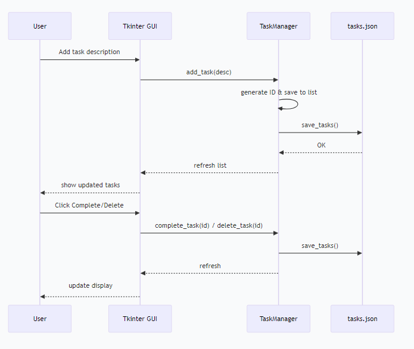

# task-manager
Help students and office workers keep track of their to-do tasks.
# Task Manager – Personal Task Management Software

## Graphical Abstract

  

*Figure: User interface – add, complete, delete tasks – data persistence with JSON
## Purpose of the Software

**Software Development Process Applied:** Agile (Scrum with 2 sprints)  
**Why Agile:** Requirements may change based on user feedback. Agile allows iterative delivery and quick adjustments, which is suitable for a small-scale personal tool.  
**Possible Usage (Target Market):**  
- Students to track assignments and exam dates  
- Professionals to manage daily to‑do items  
- Anyone needing a lightweight, offline task manager

## Software Development Plan

### Development Process

- **Members & Roles** (P2422927HUYUTONG P2405618CHENLASON P2402760LOUKOWKKEONG P2405161LOKCHIHONG)  
  - Project Manager / Developer: [HUYUTONG]  
  - Responsibilities: requirements analysis, coding, testing, documentation, demo  
  - Contribution Portion: 100%

### Schedule

| Sprint | Timeframe | Tasks |
|--------|-----------|-------|
| 1      | Day 1–3   | Basic UI, add task, display task list |
| 2      | Day 4–6   | Complete task, delete task, save/load data (JSON) |
| 3      | Day 7     | Testing, documentation, demo video recording |

### Algorithm

- **Add task:** User enters description → generate unique ID → store in list → refresh display  
- **Complete task:** Mark selected task as completed (✓)  
- **Delete task:** Remove task by ID from the list  
- **Data persistence:** Task list is saved to `tasks.json` in JSON format; loaded on startup

### Current Status

✅ All core features implemented (add, complete, delete, persistence)  
✅ Tested on Windows 10 / macOS 13 (Python 3.9+)  
⚠️ Missing: cloud sync, due date reminders

### Future Plan

- Add due dates and notifications  
- Support task categories / tags  
- Export tasks as PDF report


## Environments of Software Development and Running

- **Programming Language:** Python 3.9+  
- **Minimum Hardware:** 2 GB RAM, 100 MB disk space  
- **Software Requirements:** Windows / macOS / Linux with Python 3 installed  
- **Required Packages:** None (uses only standard libraries: `tkinter`, `json`, `datetime`)  

### How to Run

```bash
python task_manager.py
